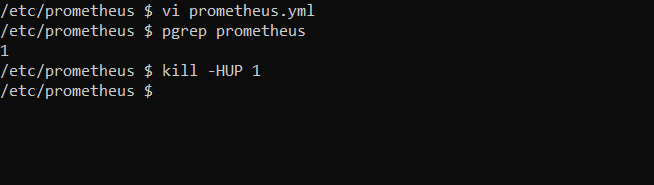
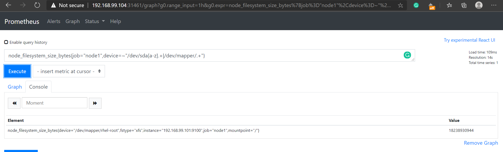
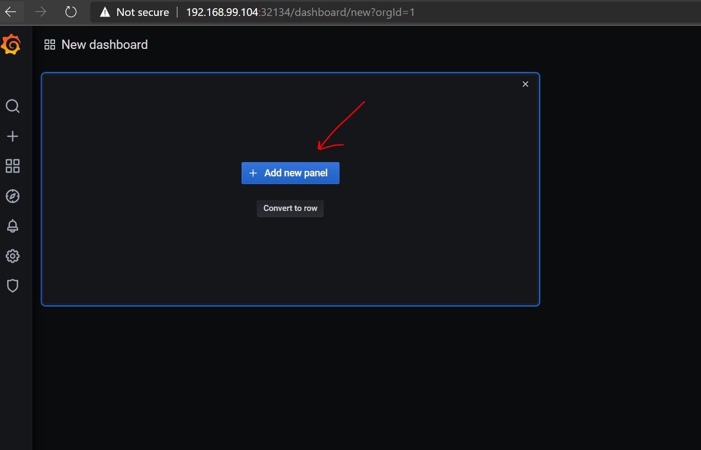

# JenkinsDockerwithPrometheus
## In this i have illustrated how to setup Prometheus & Grafana in Kubernetes in container and integrating them ***

**Assumptions:Used vimal13/prometheus and vimal13/grafana images to lauch prometheus and grafana.Kubernetes is installed.Accessing through CLI.***

STEPS:

1- start minikube.exe service & check if there are any pods or other resources running.If running clean it.Make sure your environment is clean.


2- Launch a deployment with vimal13/prometheus image.


Check its status is its succesfully running or not


3-Now expose this deployment using patting.Using the Port number we can access Prometheus succesfully on browser using IP


4-Launch a deployment with vimal13/grafana image.


Check its stautus if its successfully running


5- -Now expose this deployment using patting.Using the Port number we can access Grafana succesfully on browser using IP


6-Create a data source in Grafana and give Prometheus URL.


***Now here we will make Prometheus monitor three nodes:
```
node 0:It will monitor itself by default
node 1:It will monitor node which has RHEL8 and has node_exporter program running
node 2:It will monitor node which has RHEL8 and has node_exporter program running
node 3:It will monitor docker
```
For this we will follow following steps:***

7-Run the node_exporter program in node 1.


8-Run the node_exporter program in node 2.


9-Here node 2 has daemon.json file setup,so that Prometheus can monitor docker.Now go to cmd in Windows and get into prometheus pod and add jobs to prometheus.yml file .These jobs contain IPs of the nodes which Prometheus has to monitor


10-Now run the following kill -HUP command using the Prometheus ProcessID so that Prometheus runs without downtime


Now on Prometheus WEBUI we can see our nodes


Use the UP command to see the nodes monitored by Prometheus




11-Now we can also do visualisation using Grafana by creating Graph



